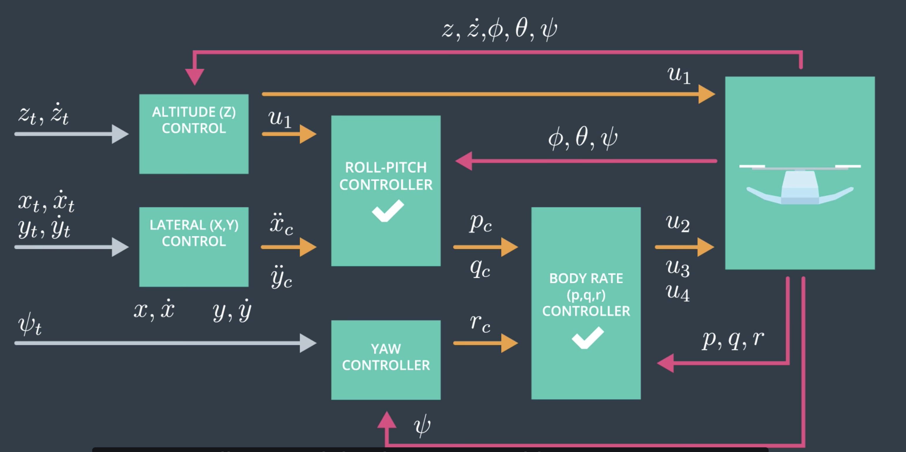
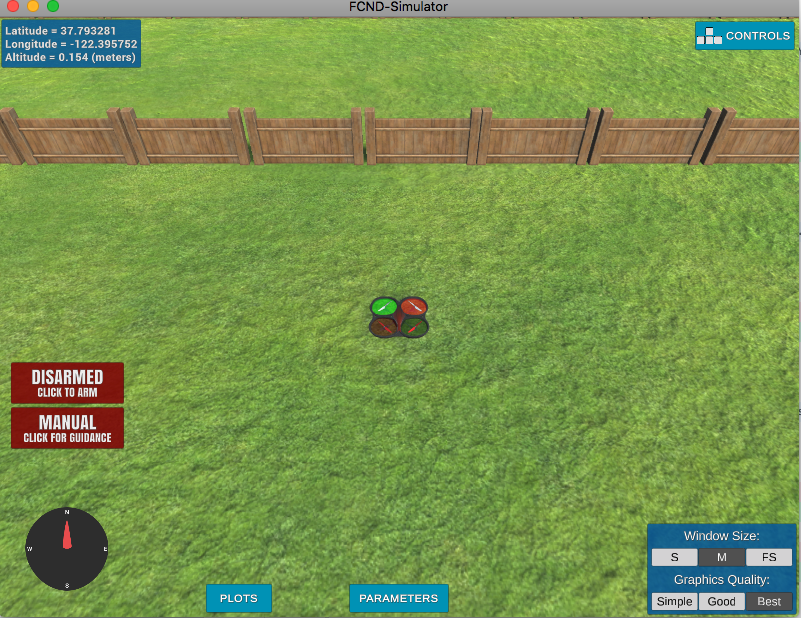
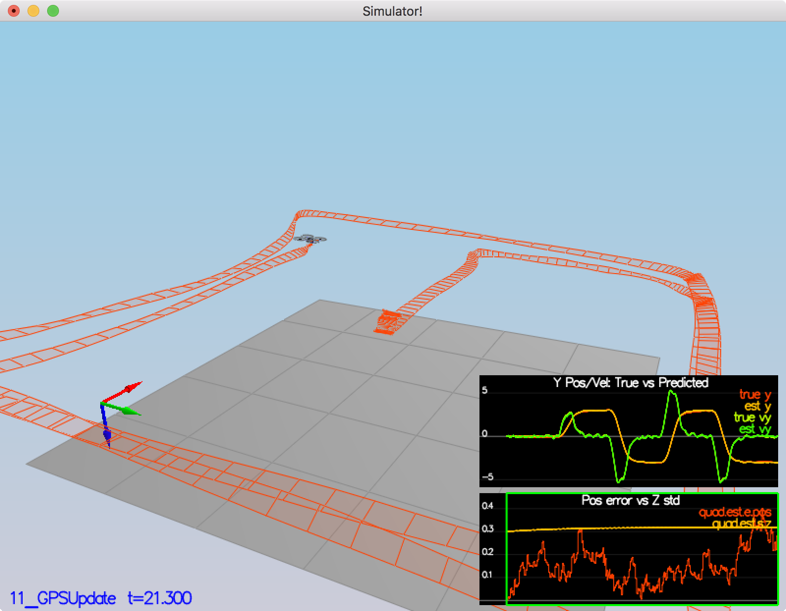

# About this repository

This repository is targeting to learn controls, planning, estimation, and more about *Flying Car*. 
In an increasingly congested world, flying cars look to the skies to provide smart transportation solutions that benefit us all.

The project is held by [Udacity](<https://www.udacity.com/course/flying-car-nanodegree--nd787>)

This project is consisted by four parts mainly.

1. Introduction
2. 3D Motion Planning
3. Controls
4. Estimation
   
## Summary of each project

### 1. Introduction
   
Learn about our quadrotor test platform, work in our custom simulator, and build your first project—getting a quadrotor to take-off and fly around a backyard!

### 2. 3D Motion Planning

Optimize 2D solutions using waypoints, then scale solutions to 3D problems. Apply these skills by autonomously navigating your drone through a dense urban environment.

### 3. Controls

Moving a flying vehicle requires determining appropriate low-level motor controls. Here, you’ll build a nonlinear cascaded controller for your drone system.

### 4. Estimation

Utilize sensor fusion and filtering. Design an Extended Kalman Filter (EKF) to estimate attitude and position from IMU and GPS data of a flying robot.

   
  