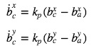
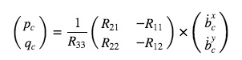
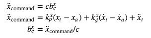
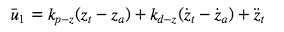
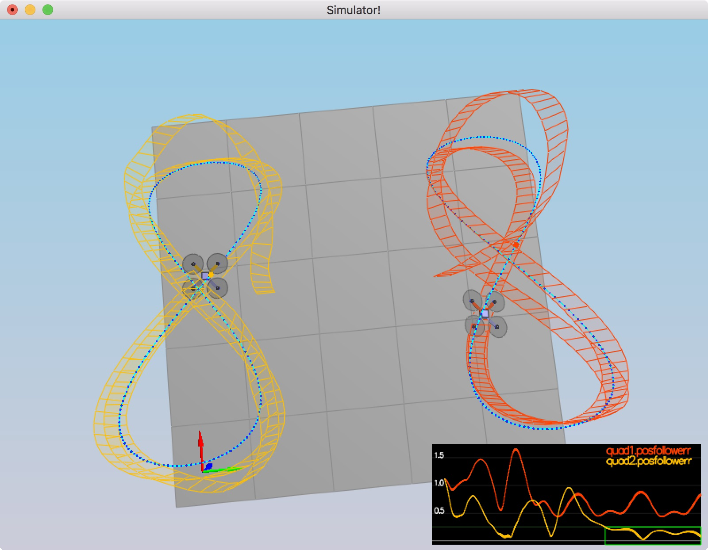

# Control of a 3D Quadrotor

This is the readme for the C++ project. 
I've learned drone controller logic so far and did some exercise in Python.

But in real world, C++ is more fast and implement more predictable behavior than Python.
So in this project objective is implement the drone controller with C++.


## The Tasks ##

For this project, I'll be implementing and tuning this controller in several steps.

The whole code is based on this [Python controller code](https://github.com/udacity/FCND-Controls/blob/solution/controller.py) and Udacity's lesson video.  

### Body rate and roll/pitch control (scenario 2) ###


I've implemented the body rate and roll / pitch control.

It is created with a small initial rotation speed about its roll axis and
controller will need to stabilize the rotational motion and bring the vehicle back to level attitude.

What I implemented are,,,

- function `GenerateMotorCommands()`
- function `BodyRateControl()`
- Parameter tuning about `kpPQR` in `QuadControlParams.txt`
- function `RollPitchControl()`
- Parameter tuning about `kpBank` in `QuadControlParams.txt`

#### GenerateMotorCommands()

This is the most low layer implementation part of controller.

What this function do is convert a desired 3-axis moment and collective thrust to individual motor thrust commands.

To achieve this, I did small calculation with bellow equation from the lesson Notebook.

From equation like this
```text
collThrustCmd = (f1 + f2 + f3 + f4)
Mx = (f1 - f2 - f3 + f4) * l
My = (f1 + f2 - f3 - f4) * l
Mz = (f1 - f2 + f3 - f4) * kappa
```
 
And calculate desired thrusts for f1, f2, f3, f4 from these four equations. Then desired thrusts will be calculated.

But one thing should be considered, the limit of thrust is exist.
So I used `CONSTRAIN` function which is useful to select middle value among three value in last part.      

#### BodyRateControl()

This is a P controller takes p,q,r(desired body rate) and convert to moment.
In this part I used V3F class for Inertia and p,q,r error to calculate each coordinate moment.
In python notebook, these are calculated each by each but this class can handle those at once.

```
V3F pqrError = pqrCmd - pqr;
V3F I;
I.x = Ixx;
I.y = Iyy;
I.z = Izz;

momentCmd = I * kpPQR * pqrError;
```

#### RollPitchControl()

The roll-pitch controller is a P controller responsible for commanding the roll and pitch rates in the body frame. 
It set the desired rate of change of the given matrix elements using a P controller. 



The given values can be converted into the angular velocities into the body frame by the next matrix multiplication (Shown in the lesson Notebook).



And to implement this function [this python code](https://github.com/udacity/FCND-Controls/blob/a1e72d1a1d554df2cd4c1eebfc25d77acfeced2a/controller.py#L173-L204) was really helpful for me.

### Position/velocity and yaw angle control (scenario 3) ###

I implement altitude and yaw control for quad drone. 
This will create 2 identical quads, one offset from its target point (but initialized with yaw = 0) and second offset from target point but yaw = 45 degrees.

- implement the code in the function `LateralPositionControl()`
- implement the code in the function `AltitudeControl()`
- tune parameters `kpPosZ` and `kpPosZ`
- tune parameters `kpVelXY` and `kpVelZ`

#### LateralPositionControl()

The LateralPositionController is PD controller to command target values for elements of the drone's rotation matrix.
The drone generates lateral acceleration by changing the body orientation which results in non-zero thrust in the desired direction.
This will translate into the commanded rotation matrix elements.
 
The control equations have the following form (Shown in the lesson Notebook)



(bx: R13, by: R23)

#### AltitudeControl()

This controller is responsible for ensuring the drone stays close to the commanded z coordinate and velocity.
PD controller is used for the altitude which results in



And also in this part [this python code](https://github.com/udacity/FCND-Controls/blob/a1e72d1a1d554df2cd4c1eebfc25d77acfeced2a/controller.py#L139-L171) was really helpful to think about the output thrust.

### Non-idealities and robustness (scenario 4) ###

In this part,exploring some of the non-idealities and robustness of a controller.
I added integral terms to AltitudeControl() and tuned some parameter again to three drone works well.

Parameter tuning was little hard part for me though out this project... 


### Tracking trajectories (scenario 5) ###

Now that I have all the working parts of a controller and test it's performance once again on a trajectory.
And the result was like this...



This is not so good trajectory so I'll get back to improve performance when I get free time.
